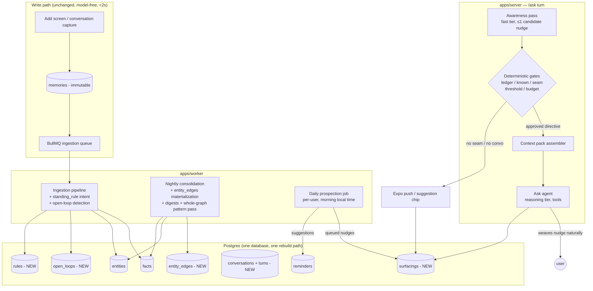

# Second Brain v2 — Architecture & Data Model

> **Spec 2 of 3.** Spec 01 explains what we're building and why each decision was
> made. This file is the technical contract: schema, components, algorithms, and
> interfaces. Spec 03 sequences the build and defines acceptance criteria.
>
> Ground rules inherited from the existing system, unchanged and non-negotiable:
> **raw memories are immutable ground truth; every derived row carries provenance;
> anything derived is rebuildable from the log; capture never waits on a model.**

---

## 1. System overview



The write path and the existing retrieval funnel (understand → hybrid search →
rerank → ground) are untouched. Everything new hangs off the same immutable log.

---

## 2. New tables

All columns follow existing conventions (uuid PKs, `user_id` FK, timezone-aware
timestamps, pgvector 1536 where embeddings apply). Drizzle schema files go in
`packages/db/schema/`.

### 2.1 `conversations` and `conversation_turns`

Chats become durable data (Spec 01, D2). The server remains RAM-stateless — the
client no longer replays transcripts; it sends `conversationId` and the server
loads turns.

```
conversations
  id            uuid PK
  user_id       uuid FK → users
  started_at    timestamptz NOT NULL default now()
  last_turn_at  timestamptz NOT NULL
  status        text NOT NULL default 'active'   -- active | idle | closed
  summary       text                              -- derived; updated when idle/closed
  turn_count    integer NOT NULL default 0
  INDEX (user_id, last_turn_at)

conversation_turns
  id               uuid PK
  conversation_id  uuid FK → conversations
  user_id          uuid FK → users
  role             text NOT NULL                  -- user | assistant
  content          text NOT NULL
  created_at       timestamptz NOT NULL default now()
  -- provenance for what the assistant did this turn:
  meta             jsonb                          -- {searches, citations, ruleIdsApplied, surfacingIds}
  INDEX (conversation_id, created_at)
```

- A conversation goes `idle` after 30 min without a turn (checked lazily / by
  cron); idle triggers summary generation (ingestion tier) and the
  conversation-capture sweep it already has today.
- **Retention (updated 2026-07-16):** transcripts are kept **forever by
  default** — a planned conversation-history feature (browse + resume past
  conversations) needs the verbatim turns. `users.transcript_retention_days
  integer` defaults to **null = keep forever**; users may opt in to pruning
  (0 = delete raw turns once the summary exists, N = prune after N days). The
  maintenance cron only prunes for users with a non-null setting, and only when
  the conversation summary exists. Summaries, memories, and ledger rows are
  never auto-deleted.

### 2.2 `rules` (procedural memory)

```
rules
  id                 uuid PK
  user_id            uuid FK → users
  rule_text          text NOT NULL            -- the behavior to apply, verbatim-faithful
  trigger_text       text NOT NULL            -- "user is about to post on social media
                                              --  or asks for feedback on a post/draft"
  trigger_embedding  vector(1536)
  active             boolean NOT NULL default true
  source_memory      uuid NOT NULL FK → memories   -- PROVENANCE, always
  created_at         timestamptz NOT NULL default now()
  last_applied_at    timestamptz
  apply_count        integer NOT NULL default 0
  superseded_by      uuid                     -- user edits rule → new row, old superseded
  INDEX (user_id) WHERE active
```

- A rule **arrives as a raw memory** (Add screen or conversation). Extraction
  (§3.1) recognizes the `standing_rule` intent and derives this row. Editing a
  rule in the UI writes a new correction memory + supersedes the old row —
  immutability preserved, class rebuildable.
- `trigger_text` is written by extraction as a *situation description*, not
  keywords. The matcher (§5.1) embeds turns against it.

### 2.3 `open_loops`

```
open_loops
  id               uuid PK
  user_id          uuid FK → users
  kind             text NOT NULL      -- commitment | unresolved_conflict | upcoming_event | goal
  title            text NOT NULL      -- "Equity split with Rahul never resolved"
  entity_id        uuid FK → entities         -- nullable
  due_at           timestamptz                -- nullable; set for upcoming_event, some commitments
  status           text NOT NULL default 'open'   -- open | resolved | expired
  resolved_by      uuid FK → memories         -- the memory that closed it, nullable
  source_memory    uuid NOT NULL FK → memories    -- PROVENANCE
  embedding        vector(1536)
  created_at       timestamptz NOT NULL default now()
  last_surfaced_at timestamptz
  INDEX (user_id, status, due_at)
  INDEX (user_id, entity_id) WHERE status = 'open'
```

- Created by extraction (§3.1) and consolidation. Resolved when a later memory
  clearly closes it (supersession-style check during ingestion: "we cleared up the
  equity thing" → resolves the loop, provenance in `resolved_by`). `upcoming_event`
  loops auto-expire after `due_at` passes + 7 days.
- Loops vs. reminders: a reminder is something the user asked to be told at a
  time. A loop is something the *system* knows is unfinished. Loops may *generate*
  suggested reminders via prospection; they are never notifications themselves.

### 2.4 `surfacings` (the ledger)

```
surfacings
  id                uuid PK
  user_id           uuid FK → users
  kind              text NOT NULL    -- rule_applied | loop_nudge | edge_nudge | date_nudge
                                     --  | pattern_nudge | absence_nudge   (content kind;
                                     --  delivery is `channel`)
  subject_type      text NOT NULL    -- rule | open_loop | entity_edge | pattern_fact | entity
  subject_id        uuid NOT NULL    -- id in the subject's table
  channel           text NOT NULL    -- conversation | push | chip
  conversation_id   uuid             -- nullable (null for push/chip)
  evidence          uuid[] NOT NULL  -- memory ids shown as receipts
  shown_at          timestamptz NOT NULL default now()
  reaction          text             -- engaged | dismissed | ignored | null (=pending)
  reaction_at       timestamptz
  suppressed_reason text             -- non-null = a gate blocked this candidate; it was
                                     --   NEVER shown. Kept for tuning/review (Spec 03).
  INDEX (user_id, subject_type, subject_id, shown_at)
```

- **Invariant: nothing proactive reaches the user without a row here.** Rule
  applications also log (kind `rule_applied`) — they're exempt from nudge budgets
  but visible in the transparency UI. Suppressed candidates are logged too
  (`suppressed_reason` set); every gate/budget/cooldown query MUST filter
  `suppressed_reason IS NULL` so blocked candidates never count as surfacings.
- Reaction capture: `dismissed` = explicit UI dismiss on the receipt affordance;
  `engaged` = the user's next turn addresses the nudge (judged by the awareness
  pass on the following turn — cheap, best-effort) or they tap the receipts;
  `ignored` = conversation ended with no engagement (set by the idle sweep).

### 2.5 `entity_edges` (materialized nightly)

```
entity_edges
  id              uuid PK
  user_id         uuid FK → users
  a_id            uuid NOT NULL FK → entities
  b_id            uuid NOT NULL FK → entities     -- a_id < b_id normalized; direction in rel_type
  rel_type        text NOT NULL       -- "co-founded with", "fell out with", "works at", ...
  status          text NOT NULL default 'active'  -- active | unresolved | ended
  strength        real NOT NULL default 0         -- co-mention frequency × recency
  last_mentioned  timestamptz
  evidence        uuid[] NOT NULL     -- supporting memory ids (multi-provenance, finally)
  updated_at      timestamptz NOT NULL
  UNIQUE (user_id, a_id, b_id, rel_type)
  INDEX (user_id, a_id), INDEX (user_id, b_id)
```

- **Derived-of-derived:** consolidation rebuilds this table from `facts` (which
  already encode subject→predicate→object) plus co-mention statistics from
  `memory_entities`. Deleting the table and re-running consolidation must
  reproduce it — that's the test of the rebuild story.
- This also fixes the known single-provenance TODO: `evidence` is an array.

### 2.6 Extended: `users`, `entities`

```
users        + transcript_retention_days integer      -- null = forever
             + quiet_hours_start / quiet_hours_end time -- default 22:00–08:00 local
             + max_daily_surfacings integer default 3
entities     + attributes jsonb                       -- {"birthday": "1998-03-12", ...}
                                                      -- extraction-populated, provenance in facts
push_tokens    (new, mobile)  user_id, device_id, expo_token, updated_at
```

---

## 3. Changed components

### 3.1 Extraction (ingestion tier — additions to the one structured call)

The single `generateObject` extraction gains three output fields (same call, same
cost envelope):

- `standingRule: { ruleText, triggerText } | null` — set when the memory is an
  instruction to the *system/self* about how to behave in a situation
  ("when I X, do/check Y"). Distinguished from a preference-fact by the presence
  of a *conditional behavior*, not just a taste.
- `openLoops: [{ kind, title, entityRef, dueAt? }]` — unfinished things stated in
  the memory. Conservative: only explicit unfinished-ness ("never resolved",
  "interview on the 24th", "I'm done with consulting" = commitment).
- `resolvesLoop: string | null` — free-text hint that this memory closes something
  ("we finally settled the equity split"); pipeline then matches against the
  user's open loops by embedding + entity and resolves on high confidence.

Pipeline stages added after fact reconciliation: upsert rule (2.2), upsert/resolve
loops (2.3). Both idempotent for safe retries. **Backfill:** a `reprocess` BullMQ
job replays extraction over all existing memories (rate-limited); required for
migration, and now a permanent capability for healing history after any
extraction improvement.

### 3.2 Consolidation (nightly, extended)

Existing: rebuild entity profiles, dedup facts, mine patterns, rescore salience.
Added:

1. **Materialize `entity_edges`** (2.5).
2. **Build digests:** per-user 7-day digest (adds + conversation summaries →
   one compact paragraph) and refresh the profile summary. Stored on a small
   `digests` table `(user_id, kind, content, updated_at)` — cheap, cache-like,
   rebuildable.
3. **Whole-graph pattern pass** (replaces/upgrades pattern mining): serialize the
   user's entire graph — entities, edges, open loops, recent memory titles — and
   hand it to the *reasoning tier* with one question: "what is connected here that
   the user may not have connected, and what patterns recur?" Output: candidate
   insight facts (`origin = consolidation`) each with ≥N evidence memory ids.
   These are **candidates only**. This is the D1 argument made real: the whole
   graph fits in one context window, so the LLM is the graph algorithm.
   **Surfacing (P5 refinement, see spec 03 P5):** candidates do NOT flow through
   the forced awareness-pass nudge. Instead `selectObservation` places at most
   one relevant, ≥5-receipt, ≥0.8-confidence, non-dismissed pattern into the
   context pack's low-priority Observations slot, and the agent decides whether
   to raise it in its reply (recording it via the `note_observation` tool). The
   §5.4 gate-4 thresholds below are enforced as the selection filter; the ledger
   invariant (`suppressed_reason IS NULL`, dismissed-forever) is enforced in the
   `getSurfaceablePatternInsights` query.

### 3.3 Prospection job (new, daily per user, morning local time)

Scans, in order:
1. `open_loops` with `due_at` in the next 7 days → for prep-type events
   (interview, exam — classified by the loop title) surface at T-3 days; for
   plain events (meeting, flight) at T-1 day.
2. Entity `attributes` dates (birthdays) → T-1 day.
3. Nudges that were gate-approved but never found a conversational seam
   (`surfacings` rows with reaction still pending + channel `conversation` that
   never rendered — see §6).

Each candidate goes through the same gates (§5.4), then: if the user opens the app
that day → context pack picks it up (in-conversation, preferred); else → one push
notification or a suggestion chip, budget permitting. Every delivery writes the
ledger.

---

## 4. The context pack

Assembled fresh per `/ask` turn in `packages/core/retrieval/context-pack.ts`.
Budget: **≤2,000 tokens**, hard-truncated in priority order (rules > nudge
directive > dated loops > digest > profile).

| Slot | Source | Freshness |
|---|---|---|
| Profile summary (~1 short para) | `digests(kind='profile')` | nightly |
| 7-day digest (~1 para) | `digests(kind='week')` | nightly |
| Matched rules (0–3) | rule matcher (§5.1) | per turn |
| Live loops | `open_loops` open, `due_at` ≤7d, plus loops on entities in this turn | per turn, one query |
| Nudge directive (0–1) | awareness pass + gates | per turn |
| Conversation summary | `conversations.summary` when turn_count high | on idle |

Injected as a clearly-delimited system-prompt section:

```
## What you currently know (context pack)
About the user: {profile}
This week: {digest}
Standing rules for THIS task (apply them visibly, they override generic behavior):
  1. {rule_text}
Open threads: {loop titles + dates, one line each}
{if nudge approved}
You may bring up ONE thing naturally if a seam appears: {nudge}. Evidence: {refs}.
Weave it in like a friend would; do not force it; skip it if the moment is wrong.
{endif}
```

The main agent's groundedness rules extend to the pack: pack contents are citable
context (their provenance rides along), not license to invent beyond them.

---

## 5. The doorways

### 5.1 Rules doorway — matcher

Per turn, before the main agent starts:
1. Embed the user's turn (plus last user turn for context) — one embedding call.
2. Cosine against active rules' `trigger_embedding`; keep candidates > 0.45.
3. If any candidates: one fast-tier structured call confirms which rules'
   *situations* actually apply to *this task* (kills "user mentions X-the-platform
   in a question about databases"). Output: rule ids.
4. Matched rules → context pack; log `rule_applied` to ledger (exempt from nudge
   budget); emit an `AskStep { kind: "rule", label: "Applying your posting rules" }`
   so the trace shows it and the UI can render the transparency affordance.

Latency: embedding + optional fast call ≈ 200–500 ms, run concurrently with pack
SQL; the Ask trace already covers perceived latency.

### 5.2 Graph doorway — entity context assembler

Trigger: entity linker over the turn (alias/lexical match against `entities`,
then embedding match; same logic ingestion uses, reused). For each confidently
linked entity (cap 2 per turn):

```
assembleEntityContext(entityId) →
  profile                       (entities.profile)
  open loops on this entity     (open_loops WHERE entity_id, status='open')
  top current facts             (facts WHERE subject/object = entity AND valid_to IS NULL, by salience, ≤8)
  1-hop edges + their status    (entity_edges, by strength, ≤6, with rel_type/status)
```

Delivered as a `get_entity_context` **tool result pre-fetched into the pack** when
confidence is high, and also exposed as a callable tool so the agent can pull it
for entities *it* discovers mid-search (scenario 2: search finds Priya → agent
pulls her context). ~1 SQL round-trip; no LLM call.

The 2-hop case (scenario 3, Rahul×Vikram) needs no traversal machinery: Rahul's
1-hop edges *include* "co-founded with Vikram (ended)", and Vikram being a known
entity is visible in the same row. The reasoning model makes the connection — the
data just has to be in front of it.

### 5.3 Time doorway

Covered by pack slot "live loops" (in-conversation) + prospection job (§3.3,
out-of-conversation). No separate component.

### 5.4 Awareness pass + gates (the proactive brain)

**Awareness pass** — one fast-tier structured call per turn, run concurrently with
pack assembly, hard deadline 800 ms (miss → no nudge this turn, candidate rolls to
next turn / conversation end):

```
input:  user turn, last ~6 turns, candidate attachments:
        - open loops on entities linked this turn
        - loops/dates due ≤7d not yet in a ledger row this week
        - unsurfaced consolidation insights touching this turn's entities/topics
output: { candidate: null | {
            kind, subjectType, subjectId, oneLineNudge, evidence: [memoryIds],
            confidence: 0–1 },
          seam: "open" | "mid_task",      -- is this a moment a friend would interject?
          engagedWithPrior: surfacingId | null }  -- reaction capture for last turn's nudge
```

**Gates** — pure functions in `packages/core/proactive/gates.ts`, executed in
order, each independently unit-testable:

| # | Gate | Rule |
|---|---|---|
| 1 | Ledger | Same subject `dismissed` ever → suppress forever (until user re-mentions it themselves). `ignored` → 30-day cooldown. `engaged` → allowed when new evidence exists. |
| 2 | Already known | Subject mentioned *by the user* in the last 48h (memories or turns) → suppress; they know. |
| 3 | Seam | `seam == "mid_task"` → hold (don't drop): candidate persists for conversation end; unclaimed at idle → prospection channel. |
| 4 | Evidence threshold | lookup-grade kinds (rule/date/edge/loop): ≥1 receipt. pattern: ≥5 receipts AND confidence ≥0.8. absence: P6 only, own spec. |
| 5 | Budget | ≤1 nudge per conversation; ≤`users.max_daily_surfacings` per day all channels; quiet hours block push only. |

Approved → ledger row (pending) + directive into the pack (§4). The **voice** is
the main agent's own: it weaves the nudge into its natural reply. The UI renders
the evidence as part of the existing sources drawer, plus a small inline
affordance on the nudge sentence ("why am I saying this" → receipts + dismiss
button). Dismiss writes `reaction = dismissed`.

---

## 6. Reach: when the user isn't chatting

- **Channels:** Expo push (server-initiated, new `push_tokens` table) and the
  existing suggestion-chip pattern on app open. Local scheduled notifications
  remain the mechanism for confirmed reminders (unchanged).
- A gate-approved nudge that never rendered in a conversation (no seam, or the
  user stopped replying) is picked up by the next prospection run and delivered as
  a push/chip — once, budget permitting, never during quiet hours.
- Push copy is generated at send time by the fast tier from the nudge + evidence,
  one line, no cliffhangers ("Your interview is Wednesday — want a prep plan?").

---

## 7. Model routing (additions)

| Call | Tier | Frequency |
|---|---|---|
| Extraction additions (rules/loops) | ingestion | same call, no new cost |
| Conversation summary on idle | ingestion | 1 / conversation |
| Rule-match confirm | fast | ≤1 / turn (only when embedding candidates exist) |
| Awareness pass | fast | 1 / turn |
| Digest + profile rebuild | ingestion | 1 / night |
| Whole-graph pattern pass | reasoning | 1 / night (skippable when graph unchanged) |
| Push copywriting | fast | ≤1 / day |

Net per-turn addition: one embedding + 1–2 fast-tier calls, overlapped with
existing retrieval latency. Reasoning-tier usage rises only at night.

---

## 8. API surface (apps/server)

```
POST /conversations                → create, returns id
POST /conversations/:id/turns      → replaces stateless /ask body; streams answer + trace
GET  /conversations?since=         → list (for app resume)
POST /surfacings/:id/reaction      → {reaction: dismissed|engaged}
GET  /entities/:id/context         → entity page payload (profile, loops, facts, edges, receipts)
GET  /rules · PATCH /rules/:id     → list / toggle-edit (edit creates correction memory)
POST /push-tokens                  → register device
GET/PATCH /settings/privacy        → retention days, quiet hours, budgets
```

`/ask` remains as a thin shim (creates a conversation implicitly) until the mobile
app migrates, then is removed.

---

## 9. The rebuild story (the test of the whole design)

From `memories` + `conversation_turns` alone, in order: replay extraction
(`reprocess`) → facts, entities, rules, loops re-derive → consolidation →
edges, profiles, digests, patterns re-derive. `surfacings` and `reminders` are
*history*, not derived — they are preserved, never rebuilt. If any table outside
those two cannot be reproduced this way, the design has been violated. CI keeps a
small end-to-end test that does exactly this on a fixture user.
